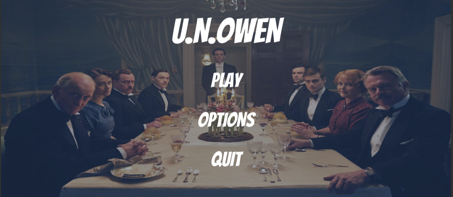

# GI-Game-Jam-2019

## Description
This is a short mysterious adventure game where you have to investigate a haunted house. But be carefule, you are not alone in thise house!
This project is an entry for University of Waterloo GI Game Jam 2019.

## Features
This game is developed using Unity and Cinemachine mainly.

## Challenges
This project was the first time I worked with a team during Game Jam. It was hard at first because of the level of communication and the short amount of time for ideation and development. During this project, I acted as both the team lead to direct and help new programmers and direct the artist of the team to design characters and draw some level components that match the game story. It was fun and we all had a great time at the jam. Our project was finished on time and well-received.

## Programming Language
C#

## Major Components
* Unity

## Innovation
There is currently no plan for innovation or remastered.

## Project Information
* Source: https://github.com/tieuchanlong/GI-Game-Jam-2019
* Online access: https://simmer.io/@tieuchanlong/u-n-owen
